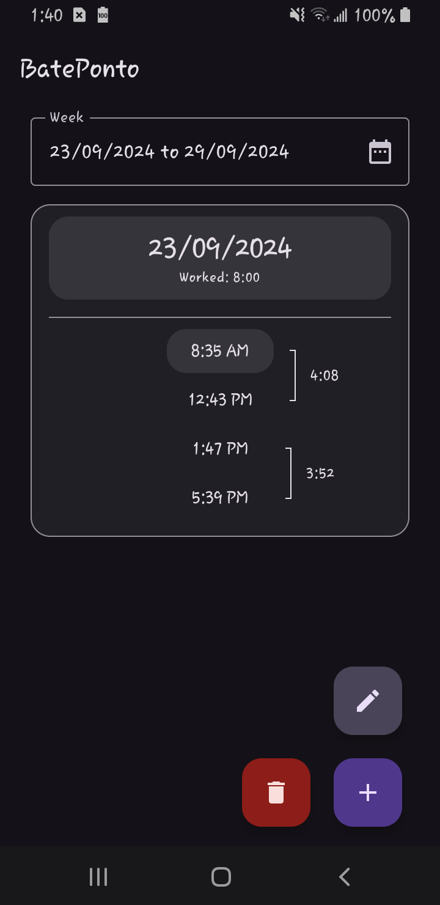

### Bate Ponto

Aplicativo para Android para rapidamente bater ponto de trabalho.

Funcionalidades:

- Salvar hora e dia atual
- Ver quanto tempo gastou trabalhando em um período de tempo e em um dia
- Editar horas marcadas
- Ver histórico de horas marcadas de semanas anteriores

Mais funcionalidades estão a vir
